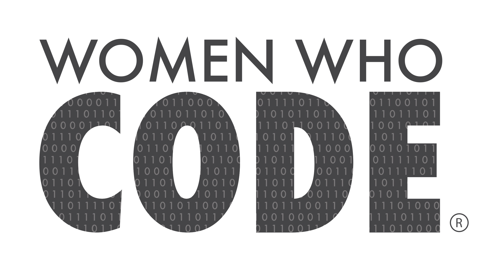

# WWCodeDFW
iOS app for Women Who Code DFW

https://invis.io/SFDV9GZW9#/257460173_Jobs_Page

## Getting Started with the Project - 
https://medium.com/@laurrenreed_40373/getting-started-with-wwcodedfw-ios-workspace-706099108f10
1. Clone down the repo - https://help.github.com/articles/cloning-a-repository/
2. Update cocoapods - 
  If you are new to coacopods, you'll need to run 'sudo gem install cocoapods' in your terminal. If you get lost, Cocoapods has some great documentation. 
      a. https://guides.cocoapods.org/using/getting-started.html
      b. https://guides.cocoapods.org/using/using-cocoapods.html
  After cocoapods is installed, navigate to the directory your WWCodeDFW xcode project is located in. My pathway looks like this '/Users/lulu/development/wwcodedfw/wwcodedfw'. Run 'pod update' in terminal.
3. Open the WWCodeDFW.xcworkspace 
4. Build the workspace! (press the play button, or command+r to build)

## Pods Usage 
1. Snapkit - https://github.com/SnapKit/SnapKit 
2. Alamofire - https://github.com/Alamofire/Alamofire
3. SwiftLint - https://github.com/realm/SwiftLint